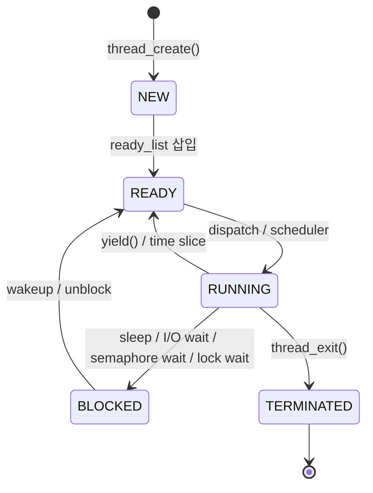

## Threads: phase 1
현재 테스트 케이스 통과 여부와 별개로, 비효율적인 로직이 발견됨
<br>

### 비효율적인 로직

**Busy Waiting**
Busy waiting이란 무엇인가?
스레드가 sleep이 되었을 때 ... 정상적이라면, sleep 상태로 cpu에 접근하지 말아야 함.
문제! 스레드가 본인이 sleep 상태임을 판단하지 못함 → cpu에서 접근, sleep 판단 → yeild 과정 밟고 있음.
문제 이해를 위해 mermaid 도식화를 보자:

여기서 ready_list에 있는 스레드들이 ready와 running을 계속 바쁘게(busy) 들어갔다 나왔다 하고 있음.
<br>

### 코드를 바탕으로 이해하기
현재 문제가 되는 코드:
```
void timer_sleep (int64_t ticks) 
{
    현재 시간을 start 변수에 저장
    int64_t start = timer_ticks ();

    현재까지 지나간 시간 < sleep 해야 하는 시간
    이 while문이 도는 경우: 해당 스레드가 cpu에 접근했을 경우 → ready_list의 말단에 있을 때
    while (timer_elapsed (start) < ticks)
        thread_yield ();
}
```
언제가 ready_list의 말단인가? ... 예시:
`A: priority 50, 사실은 sleep 중이어야 함`
`B: priority 30`
`C: priority 20`
여기서 스레드 A가 매번 들아갔다 나갔다를 반복함.
<br>

### Sleep-Awake 방식 도입
**Sleep-Awake 방식이란?**
기존안: sleep한 스레드 → ready_list에 추가(반복적인 yeild 발생)
수정안: sleep한 스레드 → sleep_list에 추가 → timer_interrupt가 확인 → ready_list로 넘김

**sleep_list는 어떻게 구현이 되어야 하는가?**
wake_tick이 가장 짧은 순으로 정렬 상태 ... 예시: `A(wake_tick=110) -> B(115) -> C(130) -> D(200)`
맨 앞의 것만 매 tick 마다 확인함으로서, 논리를 만족함

**수정해야 하는 함수**
| 함수명 | 현재 기능 | 수정 방향 | 
| :--- | :---- | :--- | 
| timer_sleep() | 반복해서 스레드를 확인 후 yeild 함 | 스레드를 sleep_list에 넣고 blocked 처리 | 
| timer_interrupt() | 틱 증가, 스레드 틱 사용 기록 | thread_awake()을 호출 코드 추가 | 

추가로 안 사실들:
→ timer_sleep()은 cpu 코어에 running하는 스레드에 sleep 시간을 명령한다.
→ timer_interrupt()은 매 tick 마다 `논리적으로 최적영역`의 스레드들을 검수 상태처리를 한다.
→ 이 인터럽트를 intr_disable()을 하면 코어의 전역(?) 인터럽트가 일시적으로 중단된다

<br>

**구현해야 하는 함수**
| 함수명 | 기능 설명 | 
| :--- | :---- | 
| thread_sleep() | sleep한 스레드를 sleep_list에 넣기 | 
| cmp_thread_ticks() | insert_ordered_list의 조건식: wake_tick 기준 | 
| thread_awake() | sleep_list의 first를 감지하여 조건 만족 시 → block 해제| 

1. thread_sleep함수:
    ```
    thread_sleep(int64_t wake_ticks){
        struct thread *cur = 현재 cpu에 running하는 스레드 가져오기
        
        interrupt를 꺼놓기
        enum intr_level old_level = intr_disable();

        sleep_list에 특정 속성을 기준으로 순차적으로 넣기
        list_insert_ordered(&sleep_list, &cur->elem, cmp_thread_ticks, NULL);
        
        스레드 블록하기: ready_list로 schedular가 집어넣지 못하게
        인터럽트 키기
    }
    ```
<br>

2. thread_awake함수:
    ```
    thread_awake(현재 틱){
        interrupt 꺼놓기
        
        while(!list_empty(&sleep_list)){
            struct thread *t = while로 순회하면 front elem 가져오기 

            if(해당 스레드의 wake_tick이 현 틱보다 작다면){
                더 이상 진행할 필요 없으니 break;
            }

            sleep_list에서 빼고, unblock한다
            list_pop_front(&sleep_list);
            thread_unblock(t);
        }

        interrupt 키기
    }
    ```
<br>

**alarm-clock구현 결과**
```
(alarm-multiple) thread 4: duration=50, iteration=5, product=250
(alarm-multiple) thread 3: duration=40, iteration=7, product=280
(alarm-multiple) thread 4: duration=50, iteration=6, product=300
(alarm-multiple) thread 4: duration=50, iteration=7, product=350
(alarm-multiple) end
Execution of 'alarm-multiple' complete.
Timer: 627 ticks
Thread: 550 idle ticks, 77 kernel ticks, 0 user ticks
Console: 2995 characters output
```
idle 틱이 대폭 늘어난 것을 확인할 수 있다.
왜 idle 틱이 늘어났는가? → cpu에 어느 work하는 스레드가 점유하지 않으면, `idle 스레드`가 점유하게 됨
따라서 ... 해당 cpu는 550 틱 동안 일을 안하는 상태였다는 것.
