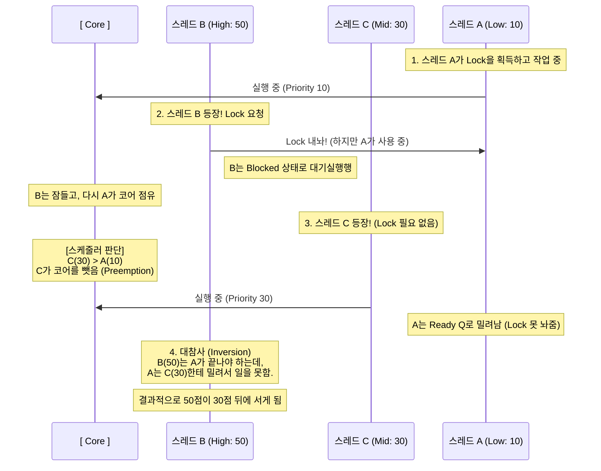

## Threads: phase 3
**Priority-Dontaion**
Priority Donation은 무엇을 의미하나?
먼저 Donation(기부, 제공)이라는 단어에 주목해 보자.
말 그대도, 다 스레드가 자신의 priority를 타 스레드에게 (임시로) 제공하는 행위를 의미.
다만, Donation은 높은 순위 → 낮은 순위 방향으로만 진행된다. 역은 성립 안함.
왜 Donation을 하는 걸까? → 우선순위 역전(priority inversion)을 방지하기 위해.
<br>

**Priority Inversion이란?**
이를 이해하기 위해서는 다음과 같은 제약 조건 이해가 선행되어야 함:
- 코어는 스레드를 구별하지 않고 priroity 순으로 가져온다
- 몇몇 스레드는 lock을 공유함(특정 자원을 공유하는 스레드들 끼리)
- lock 공유 스레드들 사이에서는 lock을 반납해야 코어 진입(서로 발이 묶임)
- 따라서 lock 공유 스레드들 사이에선 priority 선점이 강제되지 않음

다음과 같은 조건이 섞이게 되면서, priority가 높은 스레드가 뒤에 밀리는 현상 발생:

<br>

**테스트 시나리오 분석**
Priority Donation 구현을 통해 7가지의 시나리오가 통과되어야 한다
| 테스트 명 | 요구되는 구현 사항 |
| :--- | :--- |
| priority-donate-one | 스래드 lock 요청 순서: 31(main) → 32 → 33 ... 순위 갱신 되야 함 |
| priority-donate-multiple | main 스레드: 기부 순위 → 본 순위로 바로 내려가지 않고 단계적|
| priority-donate-multiple2 | 뭔지 자세히 모르겠지만 ... 위의 것과 비슷한 걸로! |
| priority-donate-nest | 중첩 기부 로직인 구현되어야 함. 현재는 직계 기부만 가능 |
| priority-donate-chain | |
| priority-donate-sema | |
| priority-donate-lower | |

<br>


### 구현 및 수정(donate-one)
**lock_acquire()**
개요: lock 획득 요청을 하는 함수, current_thread의 순위 갱신 로직 추가 필요 
실행순서: 방어코드 이후 → sema_down (&lock->semaphore)에서 대기 → lock->holder 등록
lock_acquire 순간: 획득 유무에 상관 없이 요청 스레드가 일시적을 cpu 점유
```
lock_acquire (lock 객체 포인터) {
    방어코드 호출부

    !! 여기서 curr 스레드와 hold 스레드의 priority를 비교한 다음 조건문 수행 !!

    단순히 sema_val을 낮출 뿐만 아니라, lock 획득을 위한 대기함(wait에 넣기)
    sema_down (&lock->semaphore);
    
    lock_aquire 이후 다음 아래(lock 획득)이 실행됨
	lock->holder = thread_current ();
}
```
<br>

**lock_release**
개요: hold 스레드가 lock을 내놓는 함수, 원래 순위로 복구되어야 하는 로직 필요
```
lock_release (lock 객체 포인터) {
    방어코드 호출부

	여기서 priority를 원점 복구하는 로직을 작성

	lock->holder = NULL;
	sema_up (&lock->semaphore);

	경우에 따라서 양보를 해야 한다고.. 
	thread_yield();
}
```
이해가 안가는 점: 왜 양보를 해야 하지? → 
<br>

**thread 구조체 및 생성함수**
왜 여기에다가도? → base priority를 따로 thread 내에서 보유하고 있다가, release시 원복.
클린한 코드를 작성하기 위해, thread가 create(thread_init 함수) 시기에 넣어주는 것이 좋다.
<br>


### 구현 및 수정(donate-multiple)
**thread 구조체**
다음과 같은 구조체를 추가로 구현해야 한다:
```
struct thread {
    struct list donation_list;    1. 나한테 기부한 스레드 명단
    struct list_elem d_elem;      2. ready_list의 elem 처럼 donation_list의 elem
    struct lock *wait_on_lock;    3. 어떤 락에 의해 때문에 잠들었는지
}
```
추가로 안 사실: 한 lock을 공유하는 스레드라면, 한 semaphore의 waiters에 list로 겹겹히 있다.
<br>

**lock_acquire**
```
lock_acquire (락 구조체) {
    struct thread *curr = 아직 락 획득 못한 (요청하는) 스레드

    나(curr)를 lock하는 holder 스레드가 존재한다면?
        struct thread *holder = lock->holder;
        
        holder의 donation_list에 추가하기: 내림차순
        내가 누구에 의해 lock 되었는지 명시하기
        curr->locked_by = lock;
        
        만약 lock 소유 스레드의 priority가 낮다면? => 기부

    1. 단순히 sema_val을 낮출 뿐만 아니라, lock 획득을 위한 대기함(wait에 넣기)
    2. wait에서 나오게 된다면 => 현 스레드가 락의 주인으로 등록
}
```
<br>

**lock_release**
```
lock_release (락 구조체) {
    struct thread *t = 락을 잃을 스레드

    holder 스레드의 donation_list을 뺀다 => 정확히는 .. 이 lock에 의해 대기탄 스레드들만 모두 뺸다
    => 이를 통해, 다른 락으로 donation하는 스레드들은 남게 됨
    => 주의 ... while 순회 시, d_elem이 꼬이는 것을 방지할 것!

    priority를 재설정 로직
    1. list가 비어있지 않다면 => front의 priority로 설정
    2. list가 비어있다면? => base_priorrity로 설정

    락 홀더 지우기
    sema_up (&lock->semaphore);
}
```
<br>

**이를 통해 통과한 test 시나리오들**
prioriry-donate-multiples
priority-donate-multiple2
<br>

### 구현 및 수정(donate-nest)