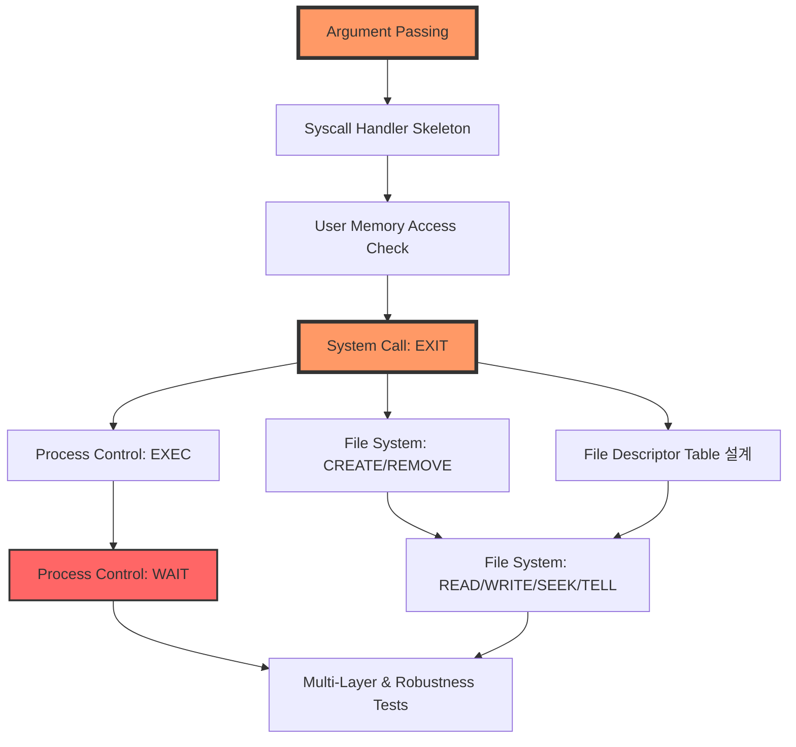

## 테스트 구성 분석
**위상정렬을 바탕으로 한 수행 순서**

 

**표 정리**
| 노드 | 단계명 | 관련 테스트 | 목표 |
| :--- | :---- | :--- | :--- | 
| A | Arg Passing | args-* | 명령어 쪼개서 스택에 예쁘게 넣어주기 |
| B | Syscall Skeleton | (전체 공통) | 유저가 부를 때 응답할 '입구' 뚫기 |
| C | Memory Check | "bad-*, sc-boundary-*" |유저가 커널 주소 찌르면 바로 컷하기 |
| D | System Call: EXIT |"exit, halt"," |""나 종료한다!""고 제대로 인사하고 죽기" |
| E/H | Branch 1: 프로세스 | "exec-*, wait-*" | 자식 낳고 죽을 때까지 잘 기다려주기 |
| F/I | Branch 2: 파일 | "create-*, open-*, read-*, write-*" | 파일 만들고 읽고 쓰는 심부름 하기 |
| G | Branch 3: 번호표(FDT) | (내부 로직) | 각 프로세스가 쓸 파일 번호표 장부 만들기 |
| J | Multi & Robustness | "multi-*, syn-*" | 떼거지로 몰려와도 안 터지고 버티기 |