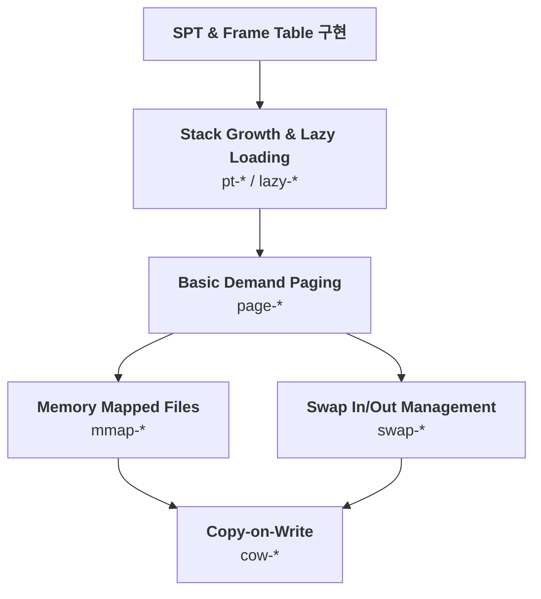

## Virtual Memory: 테스트 시나리오

**위상정렬을 통한 구현 순서 보기**

 

**표 정리**
| 노드 | 단계명 | 관련 테스트 | 목표 |
| :--- | :---- | :--- | :--- | 
| A | SPT & Frame Table | (골격 전반) | 케이스 통과에 앞서 필수로 구현해야 하는 단계 |
| B | Stack Growth & Lazy Loading | pt-* / lazy-* | SPT구현 .. stack growth 기능 확인, 이후에는 lazy(지연)로딩이 구현되었는지 체크 |
| C | Basic Demand Paging | page-* | page falut → 물리 메모리에 올리기 |
| | **병렬** | **기능 구현** | **팀별로 찢어져서 작업 가능** |
| D | 갈래 1: Memory Mapped Files |mmap-* | 파일을 메모리 처럼 쓰기, 특정 파일을 가상 주소에 mapping |
| E | 갈래 2: Swap In/Out Management |swap-* | 꽉 찰 경우, 특정 page 쫓아내고 교체하기 |
| | **통합** | **마무리** | **전체 로직 완성 및 예외 처리** |
| F | Copy-on-Write | cow-* | 보너스, write 요청 할 때만 진짜 fork함 |